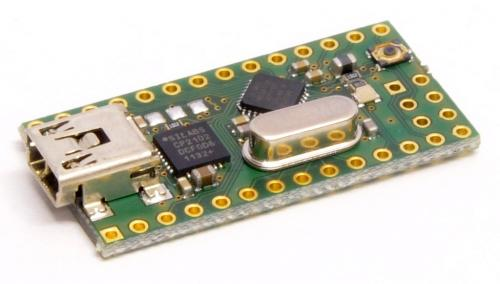
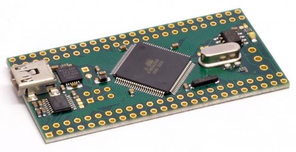

# Crumbuino-Chip45
Arduino BSP for Crumbuino Nano and Crumbuino Mega    
It is based on the [ArduinoCore-avr](https://github.com/arduino/ArduinoCore-avr)

----

Made by [Chip45](https://www.chip45.com)

----
This BSP supports     

## Crumbuino Nano
| [Crumbuino Nano](https://www.chip45.com/arduino-nano-module.html) |  |
| :-: | :-: |

 Crumbuino-Nano corresponds to our popular Crumb328 V2.3 module with the ATmega328P mikrocontroller and CP2102 USB UART converter. As Crumbuino-Nano version the module comes with Arduino bootloader preloaded and mounted 16MHz crystal. In this configuration it is comparable to Arduino Nano V3.0 module!
 
----

### Crumbuino Nano - Arduino Pin Mapping
 | Connector Con1 | Connector Con2 |
 | :-: | :-: | 
 
 | Pin# | Port | Arduino GPIO# / Function |     | Arduino GPIO# / Function | Port   | Pin# | 
 | :-:  | :-:  | :-:                      | :-: | :-:                      | :-:    | :-:  | 
 | 1    | PD0  | 0 / RX                   |     |                          | VCC    | 1    | 
 | 2    | PD1  | 1 / TX                   |     |                          | /RESET | 2    | 
 | 3    | PD2  | 2                        |     |                          | PC5    | 3    | 
 | 4    | PD3  | 3 / PWM                  |     | A4                       | PC4    | 4    | 
 | 5    | PD4  | 4                        |     | A3                       | PC3    | 5    | 
 | 6    | PD5  | 5 / PWM                  |     | A2                       | PC2    | 6    | 
 | 7    | PD6  | 6 / PWM                  |     | A1                       | PC1    | 7    | 
 | 8    | PD7  | 7                        |     | A0                       | PC0    | 8    | 
 | 9    | PB0  | 8                        |     | A7                       | ADC7   | 9    | 
 | 10   | PB1  | 9 / PWM                  |     |                          | GND    | 10   | 
 | 11   | PB2  | 10 / PWM                 |     |                          | Aref   | 11   | 
 | 12   | PB3  | 11 / PWM                 |     | A6                       | ADC6   | 12   | 
 | 13   | PB4  | 12                       |     | VCC                      | AVCC   | 13   | 
 | 14   | GND  | 16 / USART2_TX           |     | 13                       | PB5    | 14   | 
 
----
## Crumbuino Mega
| [Crumbuino Mega](https://www.chip45.com/arduino-mega-module.html) |   |
| :-: | :-: |

 Crumbuino-Mega corresponds to our popular Crumb2560 V1.1 module with the ATmega2560 mikrocontroller and CP2102 USB UART converter. As Crumbuino-Mega version the module comes with Arduino bootloader preloaded and mounted 16MHz crystal. In this configuration it is comparable to Arduino Mega 2560 module!

Due to the preloaded Arduino Bootloader and the integrated USB UART converter with mini-USB connector, the module can directly be used with the Arduino IDE as an e.g. Arduino Mega 2560 board.

Main differences to the Arduino Mega 2560 is a different pinout, no 5V regulator (the Crumbuino-Mega can be supplied through USB) and the status LED is connected to a different pin. Additionally the Crumbuino-Mega provides RS232 and RS485 interfaces, which are disabled by default, so that the IO pins can be used for other purposes. 

----

### Crumbuino Mega - Arduino Pin Mapping
 | Connector Con1 | Connector Con2 |
 | :-: | :-: | 
 
 | Pin# | Port   | Arduino GPIO# / Function |     | Arduino GPIO# / Function | Port | Pin# | 
 | :-:  | :-:    | :-:                      | :-: | :-:                      | :-:  | :-:  | 
 | 1    | TX     |                          |     |                          | VBUS | 48   | 
 | 2    | RX     |                          |     |                          | D-   | 47   | 
 | 3    | GND    |                          |     |                          | D+   | 46   | 
 | 4    | PG5    | 4 / PWM4                 |     |                          | GND  | 45   | 
 | 5    | PE0    | 0 / USART0_RX            |     |                          | VCC  | 44   | 
 | 6    | PE1    | 1 / USART0_TX            |     |                          | AREF | 43   | 
 | 7    | PE2    | 50                       |     | 68 / A0                  | PF0  | 42   | 
 | 8    | PE3    | 5 / PWM5                 |     | 69 / A1                  | PF1  | 41   | 
 | 9    | PE4    | 2 / PWM2                 |     | 70 / A2                  | PF2  | 40   | 
 | 10   | PE5    | 3 / PWM3                 |     | 71 / A3                  | PF3  | 39   | 
 | 11   | PE6    | 51                       |     | 72 / A4                  | PF4  | 38   | 
 | 12   | PE7    | 52                       |     | 73 / A5                  | PF5  | 37   | 
 | 13   | PH0    | 17 / USART2_RX           |     | 74 / A6                  | PF6  | 36   | 
 | 14   | PH1    | 16 / USART2_TX           |     | 75 / A7                  | PF7  | 35   | 
 | 15   | PH2    | 53                       |     | 76 / A8                  | PK0  | 34   | 
 | 16   | PH3    | 6 / PWM6                 |     | 77 / A9                  | PK1  | 33   | 
 | 17   | PH4    | 7 / PWM7                 |     | 78 / A10                 | PK2  | 32   | 
 | 18   | PH5    | 8 / PWM8                 |     | 79 / A11                 | PK3  | 31   | 
 | 19   | PH6    | 9 / PWM9                 |     | 80 / A12                 | PK4  | 30   | 
 | 20   | PH7    | 54                       |     | 81 / A13                 | PK5  | 29   | 
 | 21   | PB0    | 67 / SPI_SS              |     | 82 / A14                 | PK6  | 28   | 
 | 22   | PB1    | 66 / SPI_SCK             |     | 83 / A15                 | PK7  | 27   | 
 | 23   | PB2    | 65 / SPI_MOSI            |     | 22                       | PA0  | 26   | 
 | 24   | PB3    | 64 / SPI_MISO            |     | 23                       | PA1  | 25   | 
 | 25   | PB4    | 10 / PWM10               |     | 24                       | PA2  | 24   | 
 | 26   | PB5    | 11 / PWM11               |     | 25                       | PA3  | 23   | 
 | 27   | PB6    | 12 / PWM12               |     | 26                       | PA4  | 22   | 
 | 28   | PB7    | 13 / PWM13               |     | 27                       | PA5  | 21   | 
 | 29   | /RESET |                          |     | 28                       | PA6  | 20   | 
 | 30   | PL0    | 49                       |     | 29                       | PA7  | 19   | 
 | 31   | PL1    | 48                       |     | 39                       | PG2  | 18   | 
 | 32   | PL2    | 47                       |     | 62                       | PJ6  | 17   | 
 | 33   | PL3    | 46                       |     | 61                       | PJ5  | 16   | 
 | 34   | PL4    | 45                       |     | 60                       | PJ4  | 15   | 
 | 35   | PL5    | 44                       |     | 59                       | PJ3  | 14   | 
 | 36   | PL6    | 43                       |     | 58                       | PJ2  | 13   | 
 | 37   | PL7    | 42                       |     | 14 / USART3_TX           | PJ1  | 12   | 
 | 38   | PD0    | 21 / I2C_SCL             |     | 15 / USART3_RX           | PJ0  | 11   | 
 | 39   | PD1    | 20 / I2C_SDA             |     | 30                       | PC7  | 10   | 
 | 40   | PD2    | 19 / USART1_RX           |     | 31                       | PC6  | 9    | 
 | 41   | PD3    | 18 / USART1_TX           |     | 32                       | PC5  | 8    | 
 | 42   | PD4    | 55                       |     | 33                       | PC4  | 7    | 
 | 43   | PD5    | 56                       |     | 34                       | PC3  | 6    | 
 | 44   | PD6    | 57                       |     | 35                       | PC2  | 5    | 
 | 45   | PD7    | 38                       |     | 36                       | PC1  | 4    | 
 | 46   | GND    |                          |     | 37                       | PC0  | 3    | 
 | 47   | A      |                          |     | 40                       | PG1  | 2    | 
 | 48   | B      |                          |     | 41                       | PG0  | 1    | 
